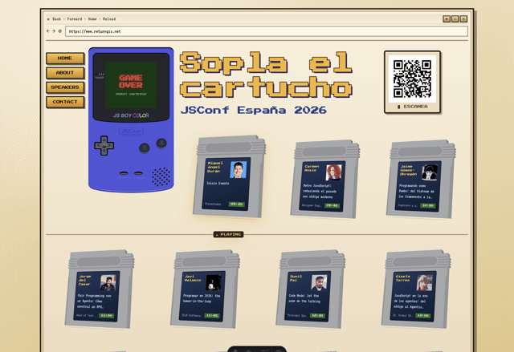
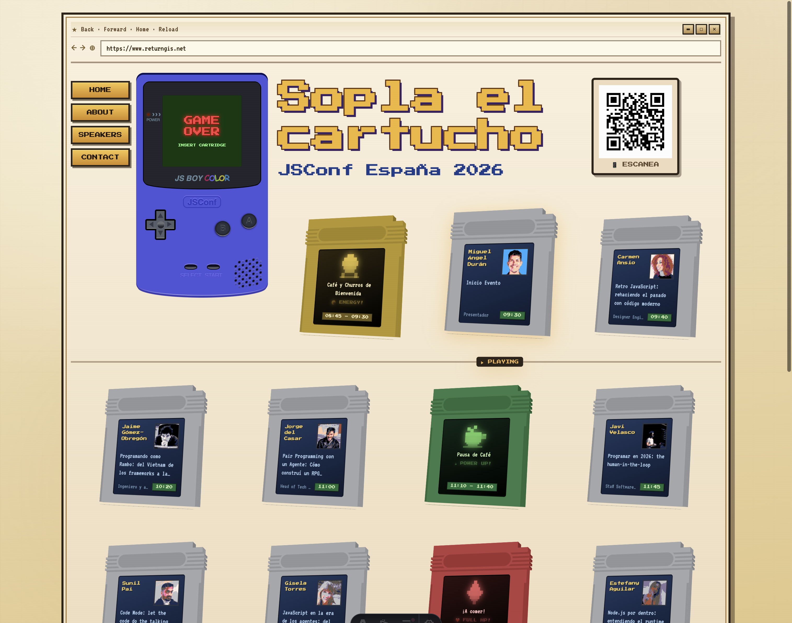
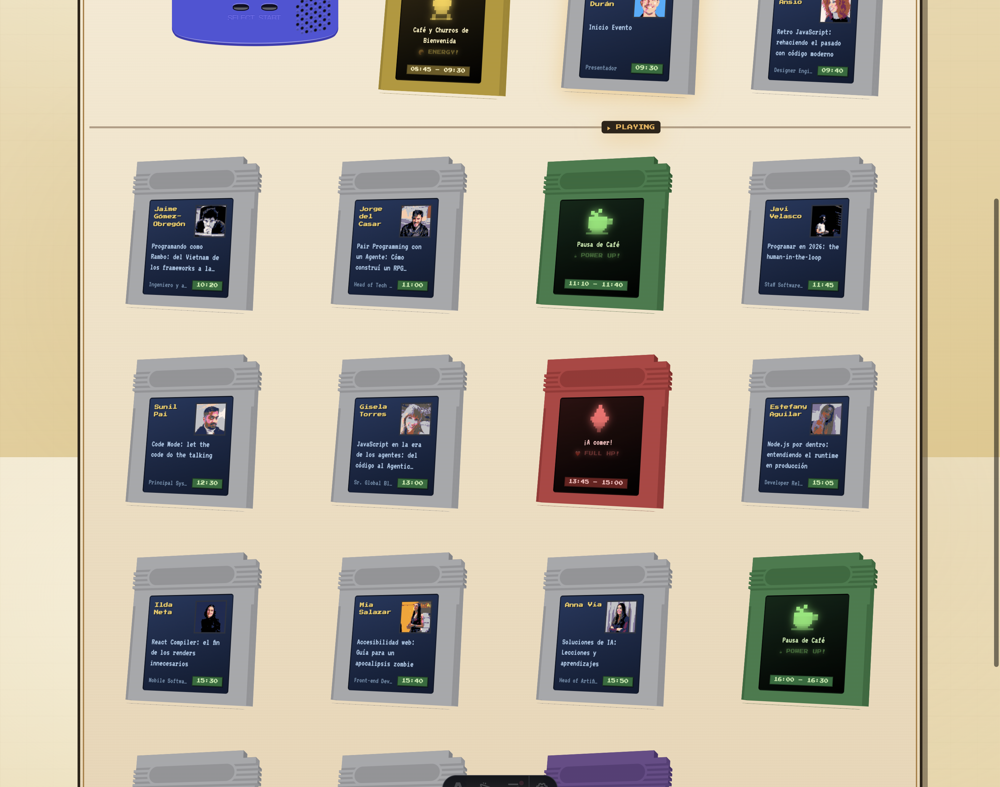

# 🎮 JavaScript en la era de los agentes: del código al Agentic DevOps

<p align="center">
  <a href="https://www.youtube.com/c/GiselaTorres?sub_confirmation=1"></a>
  <a href="https://github.com/0GiS0"></a>
  <a href="https://www.linkedin.com/in/giselatorresbuitrago/"></a>
  <a href="https://twitter.com/0GiS0"></a>
</p>

---

¡Hola developer 👋🏻! Este es el repositorio de mi charla en la **JSConf España 2026**. La IA ha pasado de autocompletar líneas a currar contigo. En esta charla te muestro cómo usar agentes e IA para montar apps con Astro, Vue o tu framework frontend favorito, y hacer que programar pueda ser (todavía más) divertido.

El resultado es **"Sopla el Cartucho"**: una web con estilo retro inspirada en la **Game Boy** y los cartuchos clásicos de los años 90, ¡construida en vivo con ayuda de agentes de IA!

## 📺 Demo



> Video completo disponible en [docs/screenshots/demo.webm](docs/screenshots/demo.webm)

## ✨ Características

- 🎮 **Diseño retro Game Boy** — Interfaz nostálgica con estética pixel art
- 📼 **Cartuchos de charlas** — Cada speaker tiene su propio cartucho personalizado
- 🍄 **Break cartridges** — Descansos estilizados como power-ups de Mario
- 🖼️ **Avatares 8-bit** — Generados automáticamente para cada speaker
- 📱 **Responsive** — Funciona en desktop y móvil
- 🔗 **QR Code** — Para compartir fácilmente en el evento

## 🚀 Tecnologías

- [Astro](https://astro.build/) — Framework web estático
- [TypeScript](https://www.typescriptlang.org/) — Tipado estático
- CSS Custom Properties — Theming retro

## 🛠️ Desarrollo

```bash
# Instalar dependencias
npm install

# Iniciar servidor de desarrollo
npm run dev

# Generar assets (avatars, covers)
npm run generate:all

# Build para producción
npm run build
```

## 📁 Estructura del proyecto

```
src/
├── components/     # Componentes Astro
│   ├── GameBoy.astro
│   ├── CartridgeCard.astro
│   └── BreakCartridge.astro
├── data/           # Datos de charlas y assets
├── layouts/        # Layouts base
├── lib/            # Utilidades
├── pages/          # Páginas
└── styles/         # Estilos globales
```

## 📸 Screenshots

### Hero Section


### Break Cartridges


## 🌐 Sígueme en Mis Redes Sociales

Si te ha gustado este proyecto y quieres ver más contenido como este, no olvides suscribirte a mi canal de YouTube y seguirme en mis redes sociales:

<p align="center">
  <a href="https://www.youtube.com/c/GiselaTorres?sub_confirmation=1"></a>
  <a href="https://github.com/0GiS0"></a>
  <a href="https://www.linkedin.com/in/giselatorresbuitrago/"></a>
  <a href="https://twitter.com/0GiS0"></a>
</p>
